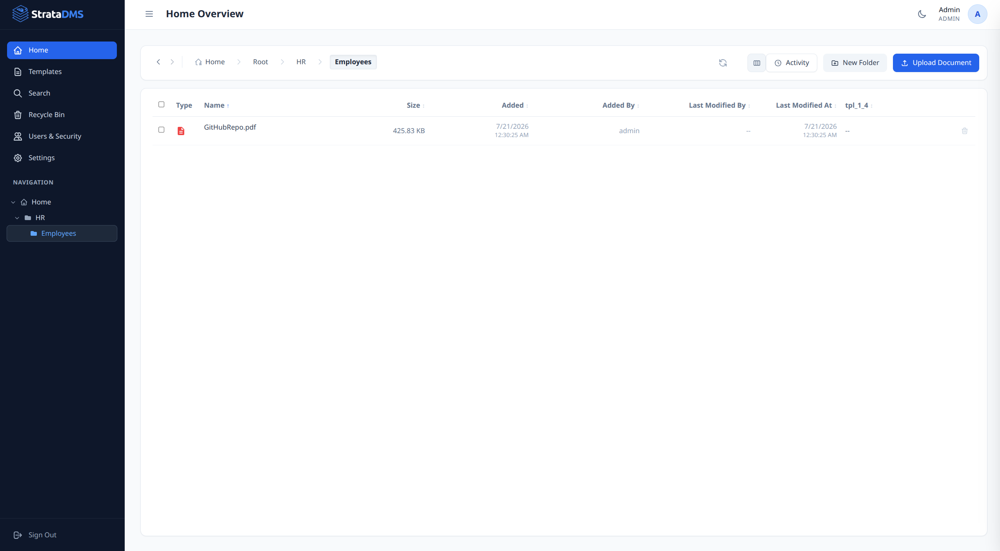
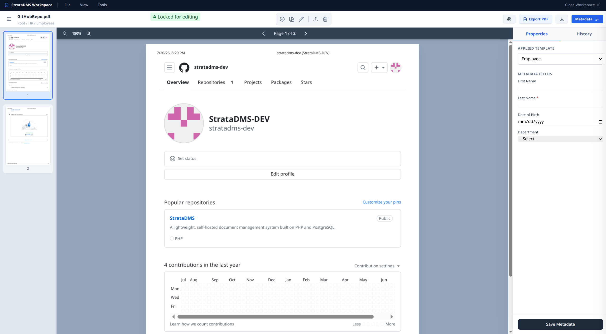
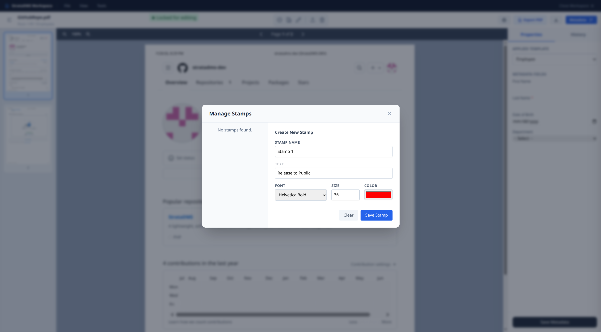
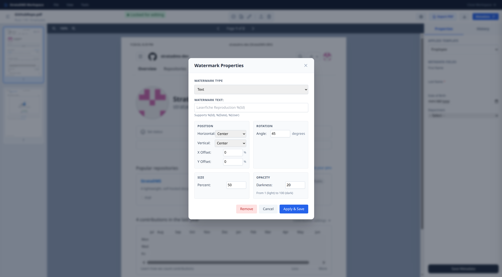
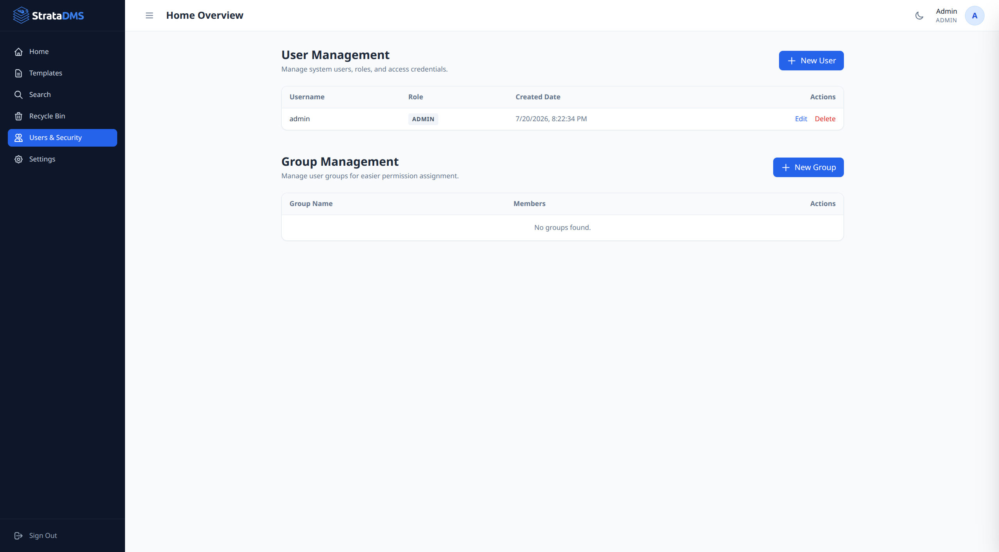

# StrataDMS - Community Edition

StrataDMS is a modern, enterprise-grade Document Management System designed for speed, security, and simplicity. The Community Edition provides all the core features you need to organize and access your files instantly, wrapped in a beautiful, premium user interface.

This is the first major release. There are definately bugs and things to improve. Please feel free to suggest improvements or fix bugs. AI Coding is awesome :-) !!!

## Features
- **Secure File Storage**: Robust document management with file locking and metadata tracking.
- **Granular Permissions**: Role-based access control (Admin/User) and directory-level permission assignments.
- **Modern UI**: A sleek, dark-mode focused, glassmorphism interface built for maximum efficiency and aesthetic appeal.
- **Recently Viewed**: Quick access to your most frequently used documents.
- **Customizable**: Adjustable settings for brand logos, password complexity, and more.

## Screenshots
<p align="center">
  
  
  
  
  
</p>

## License
StrataDMS is open-source software released under the **GNU Affero General Public License Version 3 (AGPLv3)**. Please see the `LICENSE` file for full terms and conditions.

## System Requirements
- PHP 8.0 or higher
- PostgreSQL 12 or higher (or compatible database depending on PDO drivers)
- Web Server (Apache, Nginx)
- **PDFtk** (Required for PDF manipulation, watermarking, and merging)
- **Ghostscript** (Required for PDF processing and rendering)

## Installation Guide

### 1. Database Setup
1. Create a new PostgreSQL database (e.g., `stratadms`).
2. Run the provided `schema.sql` file to initialize the required tables:
   ```bash
   psql -U postgres -d stratadms -f schema.sql
   ```

### 2. Configure Database Connection
1. Copy the `src/db.example.php` file to `src/db.php`.
2. Open `src/db.php` in a text editor.
2. Update the connection variables to match your database credentials:
   ```php
   $host = 'localhost';
   $db   = 'stratadms';
   $user = 'your_username';
   $password = 'your_password';
   ```

### 3. Web Server Configuration
1. Place the extracted `StrataDMS` folder in your web server's document root (e.g., `/var/www/html/stratadms`).
2. Configure your web server to serve the `public/` directory as the document root for security (preventing direct access to `src/` and `storage/` files).
3. Ensure the `storage/` directory and its subdirectories exist and have write permissions for the web server user (e.g., `www-data`):
   ```bash
   mkdir -p storage/documents storage/thumbnails storage/watermarks
   chmod -R 775 storage
   chown -R www-data:www-data storage
   ```

### 4. First Login
Once the setup is complete, navigate to your server's domain or IP address in your browser. 
- You can log in using the default admin credentials:
  - **Username:** `admin`
  - **Password:** `password`
- **Important:** Please change the default admin password immediately after logging in!

## Contributing
We welcome community contributions! Please read our contribution guidelines and code of conduct before submitting pull requests.

## Support
For community support, feature requests, and bug reports, please visit our community forums or open an issue in the repository.
